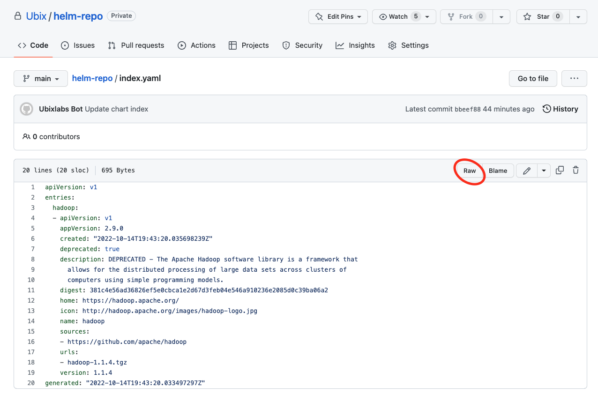
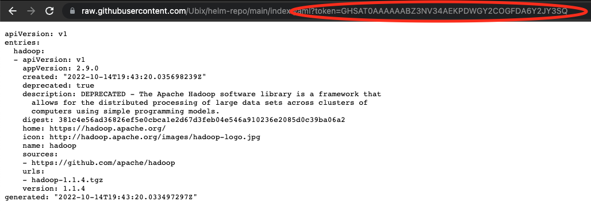

# helm-repo

This repository will function as a helm repo for Ubix

## Chart Repository Structure
The main component of any chart repository is the index file. The index file is a YAML file called index.yaml and it contains metadata about all the packages, including the information of the respective Chart.yaml files. Each entry in the index file also points to the location of the chart package, which is a .tgz file.

Note that it is not mandatory for the .tgz files and the index.yaml to be co-located, but it is often the case. The following listing shows an example repository layout.

```
.
|- index.yaml
|- mychart-0.1.2.tgz
|- mychart-0.2.0.tgz
|- yourchart-1.0.0.tgz
```

In this case, the index file would contain information about the two charts mychart and yourchart in the respective versions. 

## Packaging a chart

Please package your chart and push it to this repo, the GH Action workflow will take care of indexing it

## how to package a helm chart
Simply use the helm package command where $CHART_NAME would be the folder including your chart (with Chart.yaml, values.yaml, template/)
```
helm package $CHART_NAME --version "$CHART_VERSION"
```

For example, to package the hadoop chart
```
helm package hadoop --version 1.1.4"
```

## How to use the repo
Add this repository to your helm repositories by running the following command

```
helm repo add Ubix \
  --username <your-github-username> \
  "https://raw.githubusercontent.com/Ubix/helm-repo/main/?token=<your-github-token>"
```

Note you can get your token by navigating the index.yaml file in the Raw option:



the token will be displayed in the http address url




## Try the chart
Make sure that the repo is working correctly
`helm repo update`
```
helm search repo Ubix --devel
```

And the chart should be displayed correctly
```
NAME       	CHART VERSION	APP VERSION	DESCRIPTION
ubix/hadoop	1.1.4        	2.9.0      	DEPRECATED - The Apache Hadoop software library...
```
